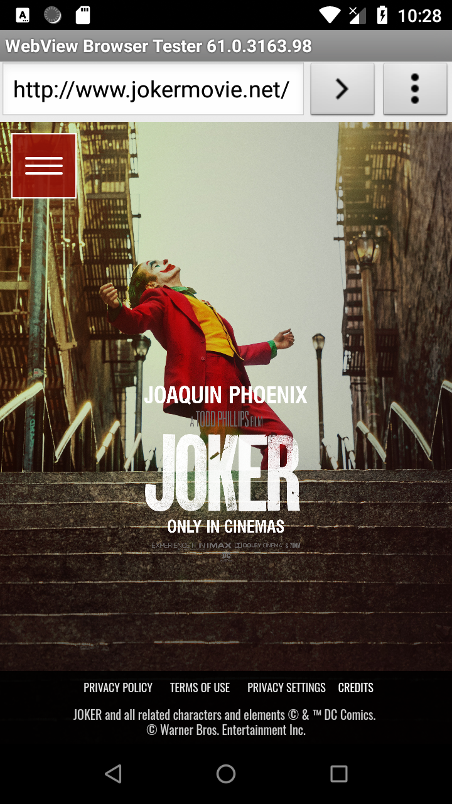

# LastMile
## ScreenShots
 |  |  

## Instructions to Build the App:
1. Download the zip from GitHub and extract and open it in Android Studio.
2. Once the studio loads the project, please rebuild the project.
3. Run the App.

Note: Enable the Wifi / Mobile Data.

## Features:
- RecyclerView shows the Popular movies info (Title, Release Year, Poster, Genres, popularity) from TMDb ordered by popularity. Each page contains 20 movies and keeps loads the next 20 movies while scrolling the recycler view.
- MovieDetails View movie details like Title, release year, poster, popularity, overview, genres, runtime & home page details when the user selects the movie from the list view.
- The app works offline(no data connection) too because caching the popular movies data & movie details data along with retrofit cache & glid libs cache using room database.

## The app has following packages:
  - adapters: It has adapters and viewholders. Adapters loads the corresponding view holders on to recyclerView based on context of the application.
  - models: All th Pojo's which also act as entities for database.
  - repositories: MovieRepository singleton class which supplies the data to view models from REST API calls and also handles the Network connection erros by implementing the NetworkListener interface.
  - rest: It has MovieApiClient singleton class which handles all the rest API calls and corresponding responses classes.
  - room: It has all the DAO's and movie databse and converters.
  - ui:View classes along with corresponding view models.
  - utils: It contains all utility classes.
  - viewmodels: It has ViewModel classes which aware of Application contexts and contains Movierepository singleton instance.
 
## Design Choices:
- I have organized the project such a way that all the business logic like extracting & processing the data from rest API's are completely separated from views and also modularised the project like adapters, models, rest, repositories, view models, UI, utils so that easy to debug and add new features quickly and also scalable.
- I have used the latest Android Architecture components ViewModels, LiveData, MutableLiveData, MediatorLiveData, Room for this project.
- The repository module in this project plays the key role to supply the data to view models/views using live-data(observer pattern) either from Rest API's or from SQLite using room library.  
- I have chosen the MVVM architecture for this project because of the following reasons:
  - MVVM separates the view(Activity, Fragments) from business logic from UI.
  - projects are very scalable if we use the MVVM. 
  - Easy to test/unit test because models, view models, views are decoupled each other whereas tightly couple in MVP pattern hence difficult unit test with MVP.
  - package structure is easier to navigate, understand the structure, maintains and adding new features even more quickly.
  - MVVM supports lifecycle aware components specifically ViewModel.
  - Google introduced the Android Architecture components view models hence google also supporting the MVVM.

## Third-party Libraries:
- Retrofit :  is a type-safe REST client for Android, Java and Kotlin developed by Square. The library provides a powerful framework for authenticating and interacting with APIs and sending network requests with OkHttp.
- Retrofit gson converter : for serialization to and from JSON.
- Glide :  is a fast and efficient image loading library for Android focused on smooth scrolling. Glide’s primary focus is on making scrolling any kind of a list of images as smooth and fast as possible.

## Android Libraries:
- lifecycle: extensions for handling lifecycles with Lifecycle-aware components.
- Jetpack: Jetpack comprises the androidx.* package libraries, unbundled from the platform APIs. It offers backward compatibility and is updated more frequently than the Android platform.
- Room: Room is a persistence library, part of the Android Architecture Components. It makes it easier to work with SQLiteDatabase objects in your app, decreasing the amount of boilerplate code and verifying SQL queries at compile time.
